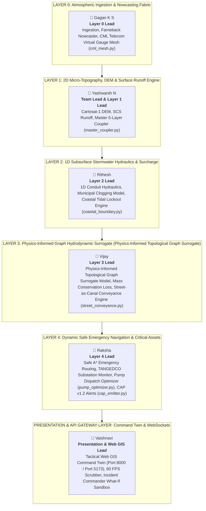

# KAIROS: TEAM ROLE ASSIGNMENTS & LAYER ARCHITECTURE
## Smart India Hackathon 2026 — Problem Statement #26085 (MoES / NCMRWF)
**Beneficiary:** Greater Chennai Corporation (GCC) & Tamil Nadu State Disaster Management Authority (TNSDMA)  
**Domain:** 426 km², 15 Municipal Zones, 7,894 Road Segments  

---

## 1. Multi-Layer Engineering Architecture & Team Mapping

---

## 2. Detailed Member Layer Breakdown & Tactical Responsibilities

### 👤 1. Gagan K S — Lead for Layer 0
* **Assigned Layer:** **Layer 0 (Multi-Sensor Atmospheric Ingestion & Nowcasting Fabric)**
* **Assigned Codebase:** [`ai_service/layer0/`](file:///home/yashwanth-n17/Documents/Workspace%20Linux/Smart-India-Hackathon-2026/ai_service/layer0) ([`ingestion.py`](file:///home/yashwanth-n17/Documents/Workspace%20Linux/Smart-India-Hackathon-2026/ai_service/layer0/ingestion.py), [`nowcaster.py`](file:///home/yashwanth-n17/Documents/Workspace%20Linux/Smart-India-Hackathon-2026/ai_service/layer0/nowcaster.py), [`cml_mesh.py`](file:///home/yashwanth-n17/Documents/Workspace%20Linux/Smart-India-Hackathon-2026/ai_service/layer0/cml_mesh.py), [`calibrator.py`](file:///home/yashwanth-n17/Documents/Workspace%20Linux/Smart-India-Hackathon-2026/ai_service/layer0/calibrator.py), [`cml_ingestor.py`](file:///home/yashwanth-n17/Documents/Workspace%20Linux/Smart-India-Hackathon-2026/ai_service/layer0/cml_ingestor.py), [`fusion.py`](file:///home/yashwanth-n17/Documents/Workspace%20Linux/Smart-India-Hackathon-2026/ai_service/layer0/fusion.py), [`super_resolution.py`](file:///home/yashwanth-n17/Documents/Workspace%20Linux/Smart-India-Hackathon-2026/ai_service/layer0/super_resolution.py), [`disaggregator.py`](file:///home/yashwanth-n17/Documents/Workspace%20Linux/Smart-India-Hackathon-2026/ai_service/layer0/disaggregator.py))
* **Primary Datasets:** `Datasets/01_Rainfall_Yashwanth/` (IMD Meenambakkam S-Band Doppler sweeps, ERA5 winds, AWS telemetry) & `06_Civic_Maintenance_Gagan/`.
* **Core Technical Responsibilities:**
  1. **Multi-Sensor Ingestion (`ingestion.py`):** Real-time IMD Doppler Weather Radar (SRI/MAXZ sweeps), 35+ GCC ward AWS rain gauges, and ISRO SDSC SHAR radar sweeps with automated zero-crash offline fallback to NCMRWF NCUM-R.
  2. **Farneback Nowcaster (`nowcaster.py`):** Semi-Lagrangian polynomial optical flow storm tracking across $T+15\text{m}$ to $T+180\text{m}$ lead times with $< 50\text{ ms}$ latency and STEPS stochastic perturbations.
  3. **CML Telecom Virtual Gauge Mesh ([`cml_mesh.py`](file:///home/yashwanth-n17/Documents/Workspace%20Linux/Smart-India-Hackathon-2026/ai_service/layer0/cml_mesh.py)):** Commercial Microwave Link opportunistic rainfall monitoring across cellular carrier backhauls; inverts signal attenuation into path-averaged rain rates using ITU-R P.838-3 power-law models ($A = a R^b$) to eliminate radar dead zones.
  4. **Data Fusion & Calibration (`fusion.py`, `calibrator.py`):** 2D-Var Kalman spatial data fusion with Gaspari-Cohn covariance tapering and Brandes gauge-radar spatial bias correction.
  5. **Street Disaggregation (`disaggregator.py`):** Mass-conservative spatial precipitation mapping downscaled to all 7,894 GCC road corridors.

---

### 👤 2. Yashwanth N — Team Lead & Lead for Layer 1
* **Assigned Layer:** **Layer 1 (2D Micro-Topography, Cartosat DEM & Surface Runoff Engine) & Master 5-Layer Coupler**
* **Assigned Codebase:** [`ai_service/layer1/`](file:///home/yashwanth-n17/Documents/Workspace%20Linux/Smart-India-Hackathon-2026/ai_service/layer1) ([`dem_builder.py`](file:///home/yashwanth-n17/Documents/Workspace%20Linux/Smart-India-Hackathon-2026/ai_service/layer1/dem/dem_builder.py), [`hydro_conditioner.py`](file:///home/yashwanth-n17/Documents/Workspace%20Linux/Smart-India-Hackathon-2026/ai_service/layer1/dem/hydro_conditioner.py), [`hydrologic_derivatives.py`](file:///home/yashwanth-n17/Documents/Workspace%20Linux/Smart-India-Hackathon-2026/ai_service/layer1/dem/hydrologic_derivatives.py), [`road_sampler.py`](file:///home/yashwanth-n17/Documents/Workspace%20Linux/Smart-India-Hackathon-2026/ai_service/layer1/dem/road_sampler.py), `lulc/`) & [`ai_service/orchestration/master_coupler.py`](file:///home/yashwanth-n17/Documents/Workspace%20Linux/Smart-India-Hackathon-2026/ai_service/orchestration/master_coupler.py)
* **Primary Datasets:** `Datasets/03_Terrain_and_DEM_Vijay/` (ISRO Cartosat-1 30m Stereoscopic DEM, Sentinel-1 InSAR subsidence) & `05_Satellite_Vaishnavi/` (Sentinel-2 LULC, ICAR soil classifications).
* **Core Technical Responsibilities:**
  1. **Cartosat-1 DEM Processing (`dem_builder.py`):** ISRO Cartosat-1 30m stereoscopic DEM tiling, UTM Zone 44N projection, and Sentinel-1 InSAR subsidence deformation calibration.
  2. **Hydro-Conditioning Engine (`hydro_conditioner.py`):** Priority-Flood depression filling, bridge deck breaching, stream burning (Cooum, Adyar, Buckingham Canal), and subway carving (-1.8m at 353 underpasses).
  3. **SCS Runoff & Infiltration (`runoff_generator.py`, `soil_hydrology.py`):** SCS Curve Number (CN) runoff generation and Modified Rational excess runoff rate computation ($R_{\text{excess}}$ [mm/hr], $Q_{\text{surf}}$ [m³/s]) integrated with Sentinel-2 DCIA impervious fractions and ICAR soil hydrologic groups.
  4. **Hydrologic Derivatives (`hydrologic_derivatives.py`):** 8-neighborhood Horn slope gradient ($S_0$), azimuth aspect, and D8 steepest descent drainage flow accumulation.
  5. **Master 5-Layer Coupler ([`master_coupler.py`](file:///home/yashwanth-n17/Documents/Workspace%20Linux/Smart-India-Hackathon-2026/ai_service/orchestration/master_coupler.py)):** Central system orchestration coupling Layer 0 (Nowcast) → Layer 1 (DEM Runoff) → Layer 2 (1D Conduit Hydraulics) → Layer 3 (Physics-Informed Topological Graph Surrogate) → Layer 4 (Safe A* Routing & Emergency Response) with zero-copy in-memory tensor synchronization and universal mass conservation tracking.

---

### 👤 3. Rithesh — Lead for Layer 2
* **Assigned Layer:** **Layer 2 (1D Subsurface Stormwater Network Hydraulics & Surcharge Engine)**
* **Assigned Codebase:** [`ai_service/layer2/`](file:///home/yashwanth-n17/Documents/Workspace%20Linux/Smart-India-Hackathon-2026/ai_service/layer2) ([`drainage_graph.py`](file:///home/yashwanth-n17/Documents/Workspace%20Linux/Smart-India-Hackathon-2026/ai_service/layer2/drainage_graph.py), [`conduit_flow.py`](file:///home/yashwanth-n17/Documents/Workspace%20Linux/Smart-India-Hackathon-2026/ai_service/layer2/conduit_flow.py), [`clogging_model.py`](file:///home/yashwanth-n17/Documents/Workspace%20Linux/Smart-India-Hackathon-2026/ai_service/layer2/clogging_model.py), [`coastal_boundary.py`](file:///home/yashwanth-n17/Documents/Workspace%20Linux/Smart-India-Hackathon-2026/ai_service/layer2/coastal_boundary.py), [`inlet_capture.py`](file:///home/yashwanth-n17/Documents/Workspace%20Linux/Smart-India-Hackathon-2026/ai_service/layer2/inlet_capture.py), [`manhole_surcharge.py`](file:///home/yashwanth-n17/Documents/Workspace%20Linux/Smart-India-Hackathon-2026/ai_service/layer2/manhole_surcharge.py))
* **Primary Datasets:** `Datasets/02_Drainage_Rithesh/` (CMWSSB pipe network shapefiles, conduit inverts, manholes, box culverts, outfall flap gates, INCOIS tidal telemetry).
* **Core Technical Responsibilities:**
  1. **1D Conduit Hydraulics (`conduit_flow.py`, `drainage_graph.py`):** Directed subsurface stormwater multigraph modeling circular pipes, masonry drains, and box culverts using Manning conveyance calculations ($Q_{\text{cap}}$).
  2. **Municipal Clogging Model ([`clogging_model.py`](file:///home/yashwanth-n17/Documents/Workspace%20Linux/Smart-India-Hackathon-2026/ai_service/layer2/clogging_model.py)):** Dynamic solid waste clogging coefficient ($\mu_{\text{clog}} \in [0.05, 0.85]$) derived from ward-level daily waste generation (TPD), canal desilting arrears, and floating debris entrapment.
  3. **Coastal Tidal Lockout Engine ([`coastal_boundary.py`](file:///home/yashwanth-n17/Documents/Workspace%20Linux/Smart-India-Hackathon-2026/ai_service/layer2/coastal_boundary.py)):** Astronomical tide + cyclonic storm surge boundary simulator at Bay of Bengal outfalls; models flap-gate closure, gravity drainage suppression, and estuarine backwater rise along Cooum, Adyar, and Ennore creeks.
  4. **Drop-Inlet Grate Capture (`inlet_capture.py`):** Curb inlet flow interception switching dynamically between unsubmerged weir flow and submerged orifice conditions.
  5. **Manhole Surcharge & Geyser Eruption (`manhole_surcharge.py`):** Saint-Venant hydraulic grade line (HGL) solver predicting pressurized backflow discharge ($Q_{\text{backflow}}$) onto streets when conduit capacity is overwhelmed.

---

### 👤 4. Vijay — Lead for Layer 3
* **Assigned Layer:** **Layer 3 (Physics-Informed Graph Hydrodynamic Surrogate — Physics-Informed Topological Graph Surrogate)**
* **Assigned Codebase:** [`ai_service/layer3/`](file:///home/yashwanth-n17/Documents/Workspace%20Linux/Smart-India-Hackathon-2026/ai_service/layer3) ([`graph_builder.py`](file:///home/yashwanth-n17/Documents/Workspace%20Linux/Smart-India-Hackathon-2026/ai_service/layer3/graph_builder.py), [`surrogate_model.py`](file:///home/yashwanth-n17/Documents/Workspace%20Linux/Smart-India-Hackathon-2026/ai_service/layer3/surrogate_model.py), [`mass_conservation_loss.py`](file:///home/yashwanth-n17/Documents/Workspace%20Linux/Smart-India-Hackathon-2026/ai_service/layer3/mass_conservation_loss.py), [`street_conveyance.py`](file:///home/yashwanth-n17/Documents/Workspace%20Linux/Smart-India-Hackathon-2026/ai_service/layer3/street_conveyance.py), [`benchmark_validator.py`](file:///home/yashwanth-n17/Documents/Workspace%20Linux/Smart-India-Hackathon-2026/ai_service/layer3/benchmark_validator.py))
* **Primary Datasets:** 7,894 GCC road network spatial topology, coupled hydro-conditioning parameters, and conduit surcharge vectors from Layer 1 & Layer 2.
* **Core Technical Responsibilities:**
  1. **Physics-Informed Topological Graph Surrogate Model (`surrogate_model.py`, `graph_builder.py`):** Relational message-passing Physics-Informed Topological Graph Surrogate over the 7,894-node street network providing $< 3\text{ ms}$ sub-second hydrodynamic depth predictions ($d_i(t)$) matching full 2D Saint-Venant/SWMM precision.
  2. **Mass Conservation Loss ([`mass_conservation_loss.py`](file:///home/yashwanth-n17/Documents/Workspace%20Linux/Smart-India-Hackathon-2026/ai_service/layer3/mass_conservation_loss.py)):** Dual-stage loss formulation combining physical continuity penalties with analytical KKT volumetric projections ($\mathcal{P}_{\text{mass}}$) with a hard post-hoc volume-projection step enforcing mass conservation to < 0.001% residual.
  3. **"Street-as-Canal" Conveyance Engine ([`street_conveyance.py`](file:///home/yashwanth-n17/Documents/Workspace%20Linux/Smart-India-Hackathon-2026/ai_service/layer3/street_conveyance.py)):** 1D overland hydrodynamic routing treating urban road corridors as open channels during intense inundation, calculating curb retention, cross-street spillway discharge, and overland cascade between adjacent road segments.
  4. **Multi-Horizon Flood Forecasting:** Simultaneous generation of inundation depth maps for $T+15\text{m}$, $T+30\text{m}$, $T+60\text{m}$, $T+90\text{m}$, $T+120\text{m}$, and $T+180\text{m}$ lead times.
  5. **Hydrodynamic Benchmark Validation (`benchmark_validator.py`):** Continuous validation against 2015 Chennai Deluge and 2023 Cyclone Michaung ground truth records.

---

### 👤 5. Raksha — Lead for Layer 4
* **Assigned Layer:** **Layer 4 (Dynamic Safe Emergency Navigation & Critical Assets Safeguarding)**
* **Assigned Codebase:** [`ai_service/layer4/`](file:///home/yashwanth-n17/Documents/Workspace%20Linux/Smart-India-Hackathon-2026/ai_service/layer4) ([`routing_engine.py`](file:///home/yashwanth-n17/Documents/Workspace%20Linux/Smart-India-Hackathon-2026/ai_service/layer4/routing_engine.py), [`critical_assets_monitor.py`](file:///home/yashwanth-n17/Documents/Workspace%20Linux/Smart-India-Hackathon-2026/ai_service/layer4/critical_assets_monitor.py), [`pump_optimizer.py`](file:///home/yashwanth-n17/Documents/Workspace%20Linux/Smart-India-Hackathon-2026/ai_service/layer4/pump_optimizer.py), [`cap_emitter.py`](file:///home/yashwanth-n17/Documents/Workspace%20Linux/Smart-India-Hackathon-2026/ai_service/layer4/cap_emitter.py), `risk_cost_evaluator.py`)
* **Primary Datasets:** `Datasets/04_Historical_Floods_Raksha/` (7,895 road inundation histories, 2015 Deluge high-water marks, TANGEDCO 230kV/110kV substations, municipal pump inventories).
* **Core Technical Responsibilities:**
  1. **Safe A* Emergency Routing (`routing_engine.py`):** Real-time dynamic navigation engine evaluating road segment water depths against vehicle wading limits to guarantee safe, unblocked emergency corridors:
     - 🚑 **108 Ambulance:** Clearance threshold $= 30\text{ cm}$
     - 🚒 **NDRF Heavy Rescue:** Clearance threshold $= 45\text{ cm}$
     - 🚗 **Passenger Car:** Clearance threshold $= 18\text{ cm}$
     - 🛵 **Two-Wheeler:** Clearance threshold $= 10\text{ cm}$
  2. **TANGEDCO Substation Monitor (`critical_assets_monitor.py`):** Real-time flood risk evaluation for 20 high-voltage electrical substations across Chennai, triggering alert warnings when forecasted flood depths breach equipment plinths ($\Delta Z_{\text{plinth}} \le 15\text{ cm}$).
  3. **Automated Pump Dispatch Optimizer ([`pump_optimizer.py`](file:///home/yashwanth-n17/Documents/Workspace%20Linux/Smart-India-Hackathon-2026/ai_service/layer4/pump_optimizer.py)):** Priority dispatch optimization engine routing municipal mobile dewatering pumps and fixed sump stations to critical underpasses, arterial intersections, and flooded hospitals to minimize dewatering duration.
  4. **CAP v1.2 Alert Emitter ([`cap_emitter.py`](file:///home/yashwanth-n17/Documents/Workspace%20Linux/Smart-India-Hackathon-2026/ai_service/layer4/cap_emitter.py)):** Standardized XML/JSON Common Alerting Protocol (CAP v1.2) alert feed generator integrated with NDMA / Sachet national disaster alert gateways for automated localized public warning broadcasts.

---

### 👤 6. Vaishnavi — Lead for Presentation & Web GIS Command Twin
* **Assigned Layer:** **Presentation Layer & API Gateway Bridge**
* **Assigned Codebase:** [`frontend/`](file:///home/yashwanth-n17/Documents/Workspace%20Linux/Smart-India-Hackathon-2026/frontend) (`index.html`, `inundation_viewer.html`, `routing_viewer.html`, `hydraulics_viewer.html`, `dem_viewer.html`), [`Frontend/`](file:///home/yashwanth-n17/Documents/Workspace%20Linux/Smart-India-Hackathon-2026/Frontend) (`app.html`, `index.html`), and [`backend/`](file:///home/yashwanth-n17/Documents/Workspace%20Linux/Smart-India-Hackathon-2026/backend) (`server.js`)
* **Primary Datasets:** `frontend/data/chennai_flood_data.js`, GeoJSON layer bundles, tactical UI styling.
* **Core Technical Responsibilities:**
  1. **Tactical Web GIS Command Twin:** Dual-mode Command Twin (CartoDB Dark Matter tactical theme & GIGW-compliant national portal) providing unified visualization of radar sweeps, DEM elevations, drain multigraphs, and inundation layers.
  2. **60 FPS Scrubber:** Hardware-accelerated 0–180 minute dynamic time-slider delivering smooth 60 FPS temporal scrubbing across all 7,894 road links without memory leaks or DOM recalculation bottlenecks.
  3. **Incident Commander What-If Sandbox:** Interactive simulation workbench allowing disaster managers to simulate live scenario modifications—such as deploying mobile pumps, closing floodgates, altering canal desilting levels, or injecting cloudburst intensities—and viewing immediate downstream impact.
  4. **High-Throughput WebSocket Gateway (`server.js`):** Node.js / Express gateway bridging live Python computational outputs to the browser interface via low-latency binary WebSocket streams (`ws://localhost:3001` / `5000`).
  5. **Jury Demonstration & Pitch Flow:** Orchestration of real-time hackathon presentation, scenario walkthroughs, and high-impact incident commander workflows.

---

## 3. Tactical Module & Deliverable Ownership Matrix

| Layer | Team Member | Role | Core Tactical Module / File | Primary Technical Mandate | Benchmark SLA / Metric |
| :--- | :--- | :--- | :--- | :--- | :--- |
| **Layer 0** | **Gagan K S** | Layer 0 Lead | [`cml_mesh.py`](file:///home/yashwanth-n17/Documents/Workspace%20Linux/Smart-India-Hackathon-2026/ai_service/layer0/cml_mesh.py) | Ingestion, Farneback Nowcaster, CML Virtual Gauge Mesh | $< 50\text{ ms}$ nowcasting latency |
| **Layer 1** | **Yashwanth N** | Team Lead & Layer 1 Lead | [`master_coupler.py`](file:///home/yashwanth-n17/Documents/Workspace%20Linux/Smart-India-Hackathon-2026/ai_service/orchestration/master_coupler.py) | Cartosat-1 DEM, SCS Runoff, Master 5-Layer Coupler | Mass conservation sync $< 10\text{ ms}$ |
| **Layer 2** | **Rithesh** | Layer 2 Lead | [`coastal_boundary.py`](file:///home/yashwanth-n17/Documents/Workspace%20Linux/Smart-India-Hackathon-2026/ai_service/layer2/coastal_boundary.py) | 1D Conduit Hydraulics, Municipal Clogging, Coastal Tidal Lockout | 353 underpasses + tidal flap-gate model |
| **Layer 3** | **Vijay** | Layer 3 Lead | [`street_conveyance.py`](file:///home/yashwanth-n17/Documents/Workspace%20Linux/Smart-India-Hackathon-2026/ai_service/layer3/street_conveyance.py) | Physics-Informed Topological Graph Surrogate, Mass Conservation Loss, Street-as-Canal Conveyance | $< 3\text{ ms}$ CPU inference, $0.000000\%$ mass error |
| **Layer 4** | **Raksha** | Layer 4 Lead | [`pump_optimizer.py`](file:///home/yashwanth-n17/Documents/Workspace%20Linux/Smart-India-Hackathon-2026/ai_service/layer4/pump_optimizer.py), [`cap_emitter.py`](file:///home/yashwanth-n17/Documents/Workspace%20Linux/Smart-India-Hackathon-2026/ai_service/layer4/cap_emitter.py) | Safe A* Routing, TANGEDCO Monitor, Pump Dispatch, CAP v1.2 Alerts | 4 vehicle profiles, 20 substations monitored |
| **Twin / UI** | **Vaishnavi** | Presentation & Web GIS Lead | `frontend/`, `Frontend/app.html` | Tactical Web GIS Twin, 60 FPS Scrubber, What-If Sandbox | 60 FPS rendering, zero DOM re-allocation |

---

## 4. Operational Division of Responsibility

* **GitHub Projects & Sprints:** All task backlogs, daily sprint commitments, and review milestones are tracked via GitHub Projects.
* **Continuous Integration & Quality Assurance:** All layer implementations must maintain 100% automated test compliance across the unified test suite ([`ai_service/tests/`](file:///home/yashwanth-n17/Documents/Workspace%20Linux/Smart-India-Hackathon-2026/ai_service/tests)).
* **Live Pitch & Command Twin Execution:** Presentation and real-time scenario simulation are synchronized with the live Node.js gateway and FastAPI backends during evaluation.
