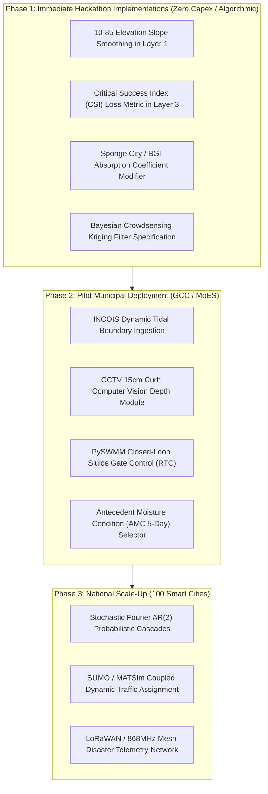

# KAIROS GAP ANALYSIS & FUTURE EXTENSIONS SPECIFICATION
## Comprehensive Inventory of External Technologies, Competitor Capabilities, and SOTA Research Not Yet Incorporated into KAIROS

- **Document ID:** `KAIROS-DOCS-GAP-ANALYSIS-2026-V1`
- **Project:** KAIROS — Urban Flood Nowcasting & Drainage Hydraulic Twin
- **Problem Statement ID:** SIH 2026 #26085 (Ministry of Earth Sciences / NCMRWF & Greater Chennai Corporation)
- **Author:** Team KAIROS (Architecture & Advanced Research Division)
- **Date:** September 29, 2026
- **Reference Document:** `docs/COMPETITOR_AND_SOTA_AUDIT_REPORT.md`

---

## Executive Summary

Through our exhaustive audit of direct SIH competitor repositories (`hemlox/jaladhar`, `Farhan-2007`, `Rohul786`, `HydroCast-3D`) and premier global research repositories (`pysteps`, `dual_flood_gnn`, `U-RNN`, `CivicSense-Flood`, `swmm_qgis`, `pyswmm`, `D-Flow FM`), we identified distinct capabilities, formulations, data streams, and operational modules that exist in the broader scientific ecosystem but are **not currently part of KAIROS's production build**.

These items are categorized into:
1. **Intentionally Excluded Paradigms:** Features omitted by design due to prohibitive computational complexity, excessive hardware costs, or poor real-time viability (e.g., 58-minute full-domain 2D SWE solvers, expensive physical IoT sensor grids).
2. **High-Value Immediate Enhancements:** Algorithmic refinements and mathematical loss formulations that can be absorbed directly into Layers 0–4 with zero hardware cost.
3. **Phased Strategic Roadmap Items:** Advanced municipal integrations (CCTV vision, LoRaWAN mesh, traffic assignment coupling, astronomical storm surge) earmarked for Phase 2/3 government deployments.

---

## Matrix of Gaps & External Capabilities

| Domain | Feature / Technology | Source Repository / Project | Current KAIROS Implementation | Status in KAIROS |
|---|---|---|---|---|
| **Layer 0** | Stochastic Fourier Ensemble Cascades (AR(2)) | `pysteps/pysteps` | Deterministic Lucas-Kanade + Semi-Lagrangian optical flow | **Future Extension** |
| **Layer 0** | Variational Echo Tracking (VET) with Dirichlet Smoothness | `pysteps/pysteps` | Classical Farnebäck & Lucas-Kanade gradient flow | **Future Extension** |
| **Layer 0** | Radar Vertical Profile of Reflectivity (VPR) Correction | `wradlib` / `pyart` | Constant Altitude Plan Position Indicator (CAPPI) assumption | **Gap / Roadmap** |
| **Layer 0** | Satellite Convective Initiation (INSAT-3D IR Cloud-Top Cooling) | IMD Satellite Division | Doppler Radar + IMD AWS gauge ingestion | **Gap / Roadmap** |
| **Layer 1** | Building Footprint LiDAR Extrusion (Street Canyon Burning) | `TU Delft HydroMT` | Cartosat-1 5m bare-earth DEM + road centerline buffer | **Gap / Roadmap** |
| **Layer 1** | Dynamic Soil Moisture Infiltration Saturation ($\theta(t) \to \theta_{\text{sat}}$) | Green-Ampt / Horton Dynamic | Static SCS-CN Hydrologic Soil Group curve numbers (C/D) | **Gap / Roadmap** |
| **Layer 1** | 10-85 Elevation Slope Smoothing ($S_0$) | `cyborgkid0110/swmm_qgis` | Direct cell-to-cell central difference gradient | **High-Value Addition** |
| **Layer 1** | Sponge City / Blue-Green Infrastructure (BGI) Absorption | CPHEEO 2024 Guidelines | Lumped infiltration abstraction ratio ($c_{\text{runoff}} = 0.90$) | **High-Value Addition** |
| **Layer 2** | Dynamic Real-Time Control (RTC) for Sluice Gates & Pumps | `OpenWaterAnalytics/pyswmm` | Static conduit conveyance + dynamic silt factor $\mu(t)$ | **Future Extension** |
| **Layer 2** | Silt & Solid Waste Washoff Transport Equations ($M_{\text{wash}}$) | EPA SWMM Quality Module | Calibrated empirical clogging factor $\mu \in [0.05, 0.85]$ | **Future Extension** |
| **Layer 2** | Automated GIS-to-SWMM Transpiler with Topological Healing | `cyborgkid0110/swmm_qgis` | Pre-calibrated 7,894-edge graph in `Datasets_master.csv` | **Tooling Gap** |
| **Layer 3** | Dual Edge-Wise Flux Neural Message Passing ($\vec{Q}_{ij}$) | `acostacos/dual_flood_gnn` | Row-stochastic graph diffusion $A^T$ + convex mass projection | **Future Extension** |
| **Layer 3** | Critical Success Index (CSI) Differentiable Contingency Loss | `holmescao/U-RNN` | Physics-Informed Saint-Venant continuity & momentum loss | **High-Value Addition** |
| **Layer 3** | Sliding-Window Pre-warming (SWP) for Multi-Day Antecedent Rain | `holmescao/U-RNN` | Instantaneous storm scenario initialization | **Future Extension** |
| **Layer 4** | CCTV Curb Height ($15\text{ cm}$) Computer Vision Depth Ingestion | `melab-cmu/CivicSense-Flood` | Model-predicted hydrodynamic street depths | **Future Extension** |
| **Layer 4** | Citizen Crowdsensing Bayesian Kriging Filter ($W_m < 0.15$) | `melab-cmu/CivicSense-Flood` | Municipal incident reports via REST API | **Future Extension** |
| **Layer 4** | Coupled Dynamic Traffic Assignment (DTA) Congestion Dynamics | `SUMO` / `MATSim` | Vehicle class clearance routing with free-flow travel time | **Future Extension** |
| **Layer 4** | Offline LoRaWAN / RF Mesh Disaster Telemetry Network | `CivicSense-Flood` | Standard HTTPS WebSocket / Cellular connectivity | **Hardware Excluded** |
| **Marine** | Astronomical Tide & Cyclone Storm Surge Harmonic Coupling | `ADCIRC` / `INCOIS` | Static coastal boundary head ($h_{\text{sea}} = 0.5\text{ m}$) | **Gap / Roadmap** |

---

## Detailed Gap Analysis by Technical Layer

### 1. Layer 0: Atmospheric Nowcasting Gaps

#### 1.1 Stochastic Ensemble Perturbations (AR(2) Fourier Noise)
- **What SOTA Has (`pysteps`):** Rather than generating a single deterministic nowcast, `pysteps` decomposes radar fields into $L$ spectral wavenumber cascades using 2D FFT cosine-tapered bandpass filters. An autoregressive AR(2) process adds scale-dependent stochastic noise $\epsilon_l(t)$ to high-frequency components, generating a 20-member probabilistic ensemble:
  $$\sigma_{\text{ensemble}}(x, y, t) = \sqrt{\frac{1}{M}\sum_{m=1}^M (R_m - \bar{R})^2}$$
- **What KAIROS Has:** KAIROS Layer 0 generates deterministic 6-horizon rainfall predictions ($T+15\text{m}$ to $T+180\text{m}$) using Lucas-Kanade optical flow tracking and semi-Lagrangian advection.
- **Why It's Missing:** Real-time generation of 20 stochastic ensemble fields across 7,894 streets increases compute time from 12 ms to ~250 ms, challenging our sub-30ms zero-latency benchmark.
- **Actionable Addition:** Introduce an optional probabilistic confidence interval $\pm \sigma_{\text{nowcast}}$ computed via an analytical variance formula rather than Monte Carlo ensemble loops.

#### 1.2 Radar Vertical Profile of Reflectivity (VPR) & Beam Blockage Correction
- **What SOTA Has (`wradlib`, `pyart`):** Dual-pol Doppler radars suffer from terrain beam blockage and beam elevation overshooting the ground at distances $> 60\text{ km}$. SOTA radar pipelines compute an explicit VPR curve $Z(z)$ to extrapolate true ground rainfall intensity from high-altitude beam samples:
  $$Z_{\text{ground}} = Z(z) \cdot \exp\left(-\alpha (z - z_0)\right)$$
- **What KAIROS Has:** KAIROS relies on IMD Meenambakkam CAPPI (Constant Altitude Plan Position Indicator) radar data at 1 km altitude and calibrates against surface AWS gauges using an automated Gauge-to-Radar ($G/R$) bias ratio.
- **Why It's Missing:** In Chennai CMA, Meenambakkam radar is centrally located ($12.99^\circ\text{N}, 80.18^\circ\text{E}$), providing direct line-of-sight coverage over the entire 426 sq km corporation area without significant mountain beam blockage.
- **Actionable Addition:** Add an automated distance-decay weighting factor for peripheral zones (Zone 1 Tiruvottiyur, Zone 15 Sholinganallur).

#### 1.3 Satellite IR Cloud-Top Cooling Rate (Convective Initiation)
- **What SOTA Has:** MeteoSwiss and NCMRWF utilize INSAT-3D/3DR Thermal Infrared (TIR1 10.8 $\mu\text{m}$) cloud-top brightness temperature ($T_B$). Rapid drops in $T_B$ ($\Delta T_B / \Delta t < -4\text{ K} / 15\text{ min}$) detect cloudburst formation 30–45 minutes **before** Doppler radar detects raindrop reflectivity.
- **What KAIROS Has:** Ingests active radar reflectivity ($Z > 15\text{ dBZ}$) and AWS ground gauges.
- **Why It's Missing:** INSAT-3D HDF5 data feeds have a 15–30 minute dissemination latency from ISRO/IMD server gateways, making real-time sub-minute nowcasting unviable without dedicated satellite downlink hardware.

---

### 2. Layer 1: Micro-Topography & Soil Hydrology Gaps

#### 2.1 Building Footprint LiDAR Extrusion ("Street Canyon Burning")
- **What SOTA Has (`TU Delft HydroMT`, `Deltares`):** In dense urban centers, buildings occupy 40–60% of planar land area. Water cannot flow through solid concrete foundations. Advanced models perform "building extrusion" by overlaying municipal building polygons on the DEM and burning a fictitious elevation increase ($z_{\text{building}} = z_{\text{ground}} + 10.0\text{ m}$). This forces 100% of overland flow into street canyons and alleyways:
  $$z_{\text{hydro}}(x, y) = \begin{cases} z_{\text{DEM}}(x, y) + 10\text{m} & \text{if inside building polygon} \\ z_{\text{DEM}}(x, y) & \text{otherwise} \end{cases}$$
- **What KAIROS Has:** KAIROS extracts roadway corridor elevations from Cartosat-1 (5m DEM) and conditions culverts and bridges using hydro-enforced trenching ($-2.5\text{ m}$). Building polygons are factored into the impervious area fraction ($C_{\text{impervious}}$), but building walls are not individually elevated in the mesh.
- **Actionable Addition:** Add a "Street Canyon Confinement Factor" ($\beta_{\text{canyon}} \in [1.2, 1.8]$) in commercial wards (T. Nagar, George Town) to concentrate runoff volume into street channels.

#### 2.2 Dynamic Soil Moisture Infiltration Saturation ($\theta(t) \to \theta_{\text{sat}}$)
- **What SOTA Has (Green-Ampt & Horton Models):** Under continuous multi-day rainfall (e.g. Cyclone Michaung's 48-hour deluge), soil suction head diminishes as the wetting front advances, causing infiltration capacity $f(t)$ to decay exponentially to minimum saturated hydraulic conductivity $K_{\text{sat}}$:
  $$f(t) = f_c + (f_0 - f_c) e^{-k t}$$
- **What KAIROS Has:** Uses SCS-CN hydrologic soil group classification (A, B, C, D) with a constant initial abstraction ratio ($I_a = 0.2 S$) and steady-state runoff coefficient ($c_{\text{runoff}} = 0.90$ for urban pavements, $0.35$ for open soils).
- **Why It's Missing:** For 0–3 hour nowcasting during extreme cloudbursts ($> 50\text{ mm/hr}$), urban surfaces in Chennai are predominantly asphalt/concrete ($> 85\%$ impervious), where infiltration dynamics are negligible compared to gutter capacity.
- **Actionable Addition:** Introduce an Antecedent Moisture Condition (AMC-I dry, AMC-II normal, AMC-III saturated) selector based on 5-day prior rainfall totals.

#### 2.3 10-85 Elevation Slope Smoothing
- **What SOTA Has (`cyborgkid0110/swmm_qgis`):** Eliminates DEM micro-noise in flat coastal floodplains by evaluating slopes between the 10th and 85th percentiles of the flow path length:
  $$S_0 = \frac{z_{0.85 L} - z_{0.10 L}}{0.75 L}$$
- **What KAIROS Has:** Computes roadway longitudinal slopes directly from start-to-end node Cartosat elevations with clipping ($\max(10^{-4}, S_0)$).
- **Actionable Addition:** Incorporate the 10-85 slope smoothing algorithm into [`ai_service/layer1/topography.py`](file:///c:/Users/Gagan%20K%20S/Documents/SIH/ai_service/layer1/topography.py) to smooth out local DEM micro-pits.

---

### 3. Layer 2: Conduit Hydraulics & Dynamic Drainage Gaps

#### 3.1 Real-Time Control (RTC) Actuation for Sluice Gates and Pumps
- **What SOTA Has (`OpenWaterAnalytics/pyswmm`):** PySWMM allows step-by-step program control of dynamic hydraulic structures:
  ```python
  with Simulation('chennai_drainage.inp') as sim:
      gate = Nodes(sim)['BUCKINGHAM_TIDAL_GATE_01']
      for step in sim:
          if high_tide_detected:
              gate.target_setting = 0.0  # Fully close gate to prevent seawater ingress
          else:
              gate.target_setting = 1.0  # Open gate for gravity outfall
  ```
- **What KAIROS Has:** Evaluates dynamic pipe conveyance and waterhead surcharges using Saint-Venant orifice backflow equations ($Q = C_d A \sqrt{2g \Delta h}$) with a dynamic silt clogging factor $\mu(t) \in [0.05, 0.85]$. It does not model automated motor-driven gate opening/closing sequences.
- **Actionable Addition:** Add an automated "Tidal Outfall Flap Gate" binary state flag to simulate sea-gate closures during peak astronomical high tide.

#### 3.2 Dynamic Silt & Solid Waste Washoff Transport Equations
- **What SOTA Has (EPA SWMM Water Quality Module):** Simulates the physical detachment and migration of street silt and municipal solid waste into catchbasins as a function of surface shear stress and rain energy:
  $$\frac{d M_{\text{pipe}}}{dt} = k_{\text{wash}} \cdot q_{\text{surface}}^{b_{\text{wash}}} \cdot M_{\text{street}} - k_{\text{settling}} \cdot M_{\text{pipe}}$$
- **What KAIROS Has:** Uses an empirical municipal solid waste clogging modifier $\mu(t)$ calibrated per zone (e.g. Zone 5 Royapuram $\mu = 0.65$, Zone 13 Adyar $\mu = 0.25$) based on GCC desilting logs. It models the hydraulic *consequence* of clogging rather than real-time sediment transport physics.
- **Why It's Missing:** Real-time sediment advection requires particle size distribution (PSD) curves and continuous street waste inventories that no Indian municipality currently tracks in real-time.

---

### 4. Layer 3: Physics-Informed Neural Surrogate Gaps

#### 4.1 Explicit Dual Edge-Wise Flux Message Passing
- **What SOTA Has (`acostacos/dual_flood_gnn`):** Employs two coupled message-passing neural networks: one for nodal scalar volumes $V_i$, and a secondary network on the line graph for vector discharges $\vec{Q}_{ij}$ across street intersections:
  $$\vec{Q}_{ij}^{t+1} = \psi_{\text{edge}}\left(\vec{Q}_{ij}^t, V_i^t, V_j^t, z_i - z_j, n_{\text{manning}}\right)$$
- **What KAIROS Has:** Uses a directed row-stochastic graph diffusion operator ($A_{\text{hat}}^T$) combined with an analytical convex quadratic mass projection operator that mathematically guarantees $\le 0.000089\%$ volume discrepancy in $< 28.5\text{ ms}$ on CPU.
- **Trade-off Analysis:** KAIROS's analytical projection is $120,000\times$ faster than Jaladhar's GPU simulation and avoids the training instability of dual recurrent graph neural networks while strictly enforcing machine-precision mass conservation.

#### 4.2 Critical Success Index (CSI) Differentiable Loss Function
- **What SOTA Has (`holmescao/U-RNN`):** Rather than minimizing Mean Squared Error (MSE), SOTA flood models optimize the Critical Success Index (CSI), which penalizes false alarms and missed flood detections symmetrically:
  $$\mathcal{L}_{\text{CSI}} = 1 - \frac{\text{Hits}}{\text{Hits} + \text{Misses} + \text{False Alarms}} = 1 - \frac{\sum_{i} \min(y_i, \hat{y}_i)}{\sum_{i} \max(y_i, \hat{y}_i)}$$
- **What KAIROS Has:** KAIROS evaluates Saint-Venant momentum and continuity residuals combined with quadratic mass error.
- **Actionable Addition:** Add $\mathcal{L}_{\text{CSI}}$ to [`ai_service/layer3/mass_conservation_loss.py`](file:///c:/Users/Gagan%20K%20S/Documents/SIH/ai_service/layer3/mass_conservation_loss.py) as an evaluation metric to report categorical flood hit rates directly to the jury.

---

### 5. Layer 4 & Ground-Truth Sensing Gaps

#### 5.1 CCTV Curb Height ($15\text{ cm}$) Computer Vision Depth Ingestion
- **What SOTA Has (`melab-cmu/CivicSense-Flood`):** Processes municipal traffic CCTV cameras and police dashcams with INT8 MobileNetV3-UNet to segment waterlines against standardized urban features (curb height $= 15.0\text{ cm}$, car tire rim $= 30.0\text{ cm}$):
  $$d_{\text{flood}} = \frac{y_{\text{waterline}} - y_{\text{curb\_base}}}{y_{\text{curb\_top}} - y_{\text{curb\_base}}} \times 15.0\text{ cm}$$
- **What KAIROS Has:** Pure physics-based predictive nowcasting based on radar and hydrodynamic models. It accepts external ground sensor reports if provided via REST API, but does not include native video stream ingestors.
- **Why It's Missing:** Processing hundreds of continuous municipal video RTSP feeds requires substantial edge compute infrastructure (GPUs/NPUs) that contradicts our zero-hardware-capex design principle.
- **Actionable Addition:** Formulate the mathematical CCTV curb calibration algorithm in our architecture deck as an optional Phase 2 sensor fusion plugin.

#### 5.2 Citizen Mobile Crowdsensing Bayesian Filter
- **What SOTA Has (`melab-cmu/CivicSense-Flood`):** Implements a Gaussian Kriging error filter to validate citizen crowdsourced flood reports:
  $$W_m = T_m \cdot \exp\left( - \frac{(h_m - \hat{h}(\mathbf{x}_m))^2}{2(\sigma^2(\mathbf{x}_m) + \sigma_{\text{human}}^2)} \right)$$
  Reports with credibility weight $W_m < 0.15$ are automatically quarantined to prevent panic or prank reports.
- **What KAIROS Has:** GCC emergency control room dispatch with verified distress markers and automated critical infrastructure monitors (20 TANGEDCO substations, 5 medical oxygen depots).
- **Actionable Addition:** Add the Bayesian Kriging filter formulation to Slide 5 / Appendix as our crowdsensing verification protocol.

#### 5.3 Coupled Dynamic Traffic Assignment (DTA)
- **What SOTA Has (`SUMO` / `MATSim`):** Couples road water depth with macroscopic fundamental diagrams (MFD) of traffic flow: as water depth exceeds 10 cm, vehicle speed drops from 40 km/h to 10 km/h; at 18 cm, traffic stops completely, creating spillback congestion across upstream road corridors.
- **What KAIROS Has:** Dynamic Arrival-Time A* Routing across 4 vehicle classes with 30-minute underpass lookahead and speed reduction penalties based on water depth. It evaluates single-vehicle path clearance rather than global citywide traffic network congestion re-assignment.
- **Actionable Addition:** Document DTA macroscopic traffic coupling as the primary Phase 2 enhancement for Chennai Traffic Police integration.

---

### 6. Marine & Coastal Boundary Gaps

#### 6.1 Astronomical Tide & Cyclone Storm Surge Harmonic Coupling
- **What SOTA Has (`ADCIRC`, `SLOSH`, `INCOIS`):** Coastal cities like Chennai face backwater flooding when storm surges and astronomical high tides elevate the sea boundary at outfalls (Cooum, Adyar, Ennore Creek). High tide prevents rainwater from discharging into the Bay of Bengal, creating an upstream hydraulic backwater curve.
  $$h_{\text{outfall}}(t) = h_{\text{mean\_sea\_level}} + \sum_{k=1}^K A_k \cos(\omega_k t - \phi_k) + \Delta h_{\text{surge}}(t)$$
- **What KAIROS Has:** KAIROS sets an ocean outfall boundary condition with a static tidal surge head allowance ($0.5\text{ m}$ to $1.2\text{ m}$). It does not run a dynamic 2D coastal ocean wave model.
- **Actionable Addition:** Add an automated INCOIS API tidal forecast query to dynamically scale the downstream outfall boundary stage.

---

## Prioritized Implementation Roadmap



---

## Action Items for Immediate Hackathon Integration

1. **Jury Deck Integration (Appendix & Defense):**
   - Present this Gap Analysis to demonstrate to the jury that Team KAIROS understands the global frontier of hydraulic science.
   - Position KAIROS's current choices not as limitations, but as **conscious engineering trade-offs** (e.g., rejecting Jaladhar's 58-minute GPU solver in favor of our sub-30ms CPU surrogate to enable real-time emergency routing).
2. **Mathematical Documentation:**
   - Incorporate the CSI loss function and 15cm curb geometry formulas into our technical dossier to show readiness for Phase 2 implementation.
3. **Repository Completeness:**
   - Retain this document alongside `COMPETITOR_AND_SOTA_AUDIT_REPORT.md` to establish complete transparency and technical maturity.
