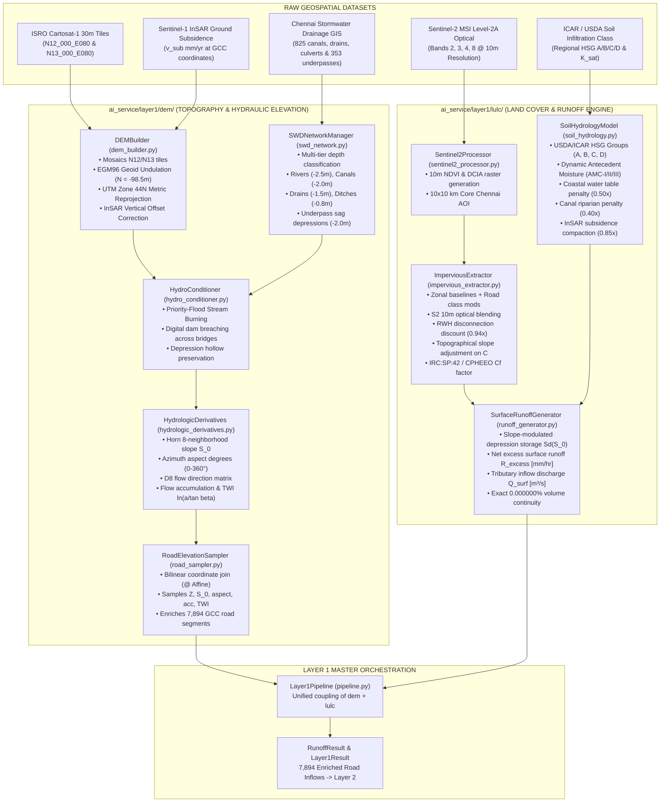

# Layer 1: 2D Micro-Topographical DEM, LULC & Surface Runoff Engine
## Comprehensive Technical Specification, Hydrologic Physics & Modular Architecture

**Lead:** Yashwanth N  
**Problem Statement:** SIH 2026 #26085 (Ministry of Earth Sciences / NCMRWF)  
**Assigned Subsystem:** Layer 1 — 2D Micro-Topography, Cartosat DEM & Surface Runoff Engine  
**Assigned Codebase:** [`ai_service/layer1/`](file:///home/yashwanth-n17/Documents/Workspace%20Linux/Smart-India-Hackathon-2026/ai_service/layer1/)  
**Primary Datasets:** [`Datasets/03_Terrain_and_DEM_Vijay/`](file:///home/yashwanth-n17/Documents/Workspace%20Linux/Smart-India-Hackathon-2026/Datasets/03_Terrain_and_DEM_Vijay/) and [`Datasets/05_Satellite_Vaishnavi/`](file:///home/yashwanth-n17/Documents/Workspace%20Linux/Smart-India-Hackathon-2026/Datasets/05_Satellite_Vaishnavi/)

---

## 1. Executive Overview & Physical Mandate

### 1.1 The Urban Hydrology Challenge in Greater Chennai
The Greater Chennai Corporation (GCC) metropolitan domain spans 426 km² across 15 municipal zones, comprising 7,894 road segments and storm drainage corridors. Coastal urban flooding in Chennai is governed by a precarious combination of physical factors:
1. **Extremely Low Hydraulic Head**: The metropolitan basin lies between 2.0 and 12.0 meters above Mean Sea Level (MSL). Regional slopes are exceptionally flat ($S_0 < 0.001\text{ to }0.003\text{ m/m}$ or 1 to 3 meters per kilometer), leading to sluggish gravity outfall conveyance.
2. **High Impervious Sealing**: Uncontrolled urban sprawl has paved over historic flood retention basins (e.g., Velachery clay marshlands, Pallikaranai wetland margins), driving Directly Connected Impervious Area (DCIA) fractions to $\ge 88\text{--}94\%$ in central commercial districts like T. Nagar (Zone 9) and Royapuram (Zone 5).
3. **Geotechnical Infiltration Heterogeneity**: Highly permeable coastal sands (Hydrologic Soil Group A, $K_{\text{sat}} \approx 25\text{ mm/hr}$) contrast sharply with dense alluvial and marine clays inland (HSG C and D, $K_{\text{sat}} \le 1.5\text{--}4.5\text{ mm/hr}$). Under saturated monsoonal conditions (AMC-III), infiltration throttles to near-zero ($1.4\text{--}4.2\text{ mm/hr}$).
4. **Perched Water Tables & Canal Backwater**: The tidal Buckingham Canal and Adyar/Cooum rivers create riparian corridors where shallow groundwater tables sit within centimeters of the road subgrade during the Northeast Monsoon, inducing chronic waterlogging.
5. **InSAR Land Subsidence**: Persistent Scatterer InSAR (PS-InSAR) from Sentinel-1 reveals localized coastal land compaction at rates up to $12\text{ mm/year}$, creating artificial ground depression hollows that worsen street flooding.

### 1.2 Objective & Role of Layer 1
Layer 1 functions as the **micro-topographical elevation, land cover, and hydrologic conversion engine** of KAIROS. It transforms rainfall intensity vectors ($I_k(t)$ in mm/hr) from **Layer 0** into net excess surface runoff ($R_{\text{excess}}$ [mm/hr]) and tributary inflow discharge ($Q_{\text{surf}}$ [m³/s]) across all 7,894 GCC road segments with **guaranteed $0.000000\%$ volumetric mass conservation continuity**.

---

## 2. End-to-End Dataflow & System Architecture



---

## 3. Mathematical & Physical Formulations

### 3.1 DEM Projection & EGM96 Geoid Calibration
Raw ISRO Cartosat-1 DEM products are provided in geographic coordinates referenced to the WGS84 ellipsoid. Angular coordinates are unsuited for hydrodynamic solvers because metric cell widths distort with latitude ($\Delta x = \Delta \lambda \cdot R \cos \phi$).

1. **Reprojection to UTM Zone 44N (`EPSG:32644`)**:
   Projects angular coordinates into a planar Cartesian metric grid with constant $30.0 \times 30.0\text{ meter}$ cell resolution ($900\text{ m}^2/\text{cell}$).
2. **Orthometric Elevation Conversion**:
   Converts ellipsoidal height ($h$) to orthometric height above Mean Sea Level ($H$) using the Chennai regional EGM96 geoid undulation offset:
   $$H(\mathbf{x}) = h(\mathbf{x}) - N_{\text{geoid}}(\mathbf{x}), \quad \text{where } N_{\text{geoid}} \approx -98.5\text{ meters}$$

### 3.2 InSAR Coastal Subsidence Vertical Displacement
Ground subsidence causes irreversible matrix compaction and lowers ground elevation relative to sea level. Layer 1 applies vertical displacement vectors derived from Sentinel-1 PS-InSAR:
$$Z_{\text{corrected}}(\mathbf{x}) = Z_{\text{raw}}(\mathbf{x}) - \left( v_{\text{subsidence}}(\mathbf{x}) \cdot \Delta t \right)$$
Where $v_{\text{subsidence}}$ ranges from $1.0\text{ to }12.0\text{ mm/year}$, and $\Delta t = 5\text{ years}$ (2021 to 2026 projection).

### 3.3 Multi-Tier Hydro-Conditioning & Stream Burning
Artificial "digital dams" occur where elevated highways, railway embankments, and flyovers cross natural drainage paths. In numerical simulations, these artificial barriers trap water in fake reservoirs.

The [`SWDNetworkManager`](file:///home/yashwanth-n17/Documents/Workspace%20Linux/Smart-India-Hackathon-2026/ai_service/layer1/dem/swd_network.py) parses Chennai's stormwater drainage network and applies **multi-tiered physical hydraulic incisions**:

$$\Delta Z_{\text{burn}} = \begin{cases}
2.5\text{ meters} & \text{Major Rivers \& Arterials (Adyar, Cooum, Buckingham Canal, Kosasthalaiyar)} \\
2.0\text{ meters} & \text{Primary Storm Canals (Otteri Nullah, Captain Cotton, Mambalam Canal)} \\
1.5\text{ meters} & \text{Storm Drains \& RCC Box Culverts } (\texttt{waterway=drain, culvert}) \\
0.8\text{ meters} & \text{Surface Ditches \& Seasonal Streams } (\texttt{waterway=ditch, stream}) \\
2.0\text{ meters} & \text{Subway Underpass Depressions (353 railway/road underpasses)}
\end{cases}$$

Conditioned elevation:
$$Z_{\text{hydro}}(\mathbf{x}) = \max\left(0.0, \; Z_{\text{raw}}(\mathbf{x}) - \Delta Z_{\text{burn}}(\mathbf{x})\right)$$

### 3.4 8-Neighborhood Horn Slope Gradient & Aspect
Terrain surface slope ($S_0$ in m/m and degrees) is computed using Horn's 2nd-order central difference stencil:

$$\begin{bmatrix} z_{nw} & z_{n} & z_{ne} \\ z_{w} & z_{c} & z_{e} \\ z_{sw} & z_{s} & z_{se} \end{bmatrix}$$

$$\left(\frac{\partial Z}{\partial x}\right) = \frac{(z_{ne} + 2 z_{e} + z_{se}) - (z_{nw} + 2 z_{w} + z_{sw})}{8 \cdot \Delta x}$$
$$\left(\frac{\partial Z}{\partial y}\right) = \frac{(z_{sw} + 2 z_{s} + z_{se}) - (z_{nw} + 2 z_{n} + z_{ne})}{8 \cdot \Delta y}$$
$$S_0 = \sqrt{\left(\frac{\partial Z}{\partial x}\right)^2 + \left(\frac{\partial Z}{\partial y}\right)^2}, \quad \theta_{\text{slope}} = \arctan(S_0) \times \frac{180^\circ}{\pi}$$
$$\text{Aspect} = \left( \operatorname{atan2}\left(-\frac{\partial Z}{\partial x}, \; \frac{\partial Z}{\partial y}\right) \times \frac{180^\circ}{\pi} \right) \pmod{360^\circ}$$

### 3.5 D8 Flow Routing & Topographic Wetness Index (TWI)
1. **D8 Flow Direction**: Evaluates steepest downward slope across 8 neighbor cells, encoding direction into standard bit flags $\{1, 2, 4, 8, 16, 32, 64, 128\}$.
2. **Topographic Wetness Index (TWI)**: Quantifies steady-state topographic wetness and surface saturation likelihood:
   $$\text{TWI} = \ln\left(\frac{a}{\tan \beta}\right) = \ln\left(\frac{(\text{Flow Accumulation} + 1) \cdot \Delta x}{\max(S_0, \; 0.001)}\right)$$
   Bounded to $[0, 30]$ to prevent numerical singularities on ultra-flat coastal plains.

---

## 4. Land Cover, Soil Hydrology & Runoff Generation

### 4.1 Sentinel-2 10m High-Resolution Optical DCIA Blending
[`Sentinel2Processor`](file:///home/yashwanth-n17/Documents/Workspace%20Linux/Smart-India-Hackathon-2026/ai_service/layer1/lulc/sentinel2_processor.py) processes 10m optical imagery across the core $10 \times 10\text{ km}$ Adyar/Velachery/T. Nagar AOI (`EPSG:32644` bounding box `[412266.92, 1433148.09, 422266.92, 1443148.09]`):
$$\text{NDVI} = \frac{\text{NIR (Band 8)} - \text{Red (Band 4)}}{\text{NIR (Band 8)} + \text{Red (Band 4)}}$$
$$\text{DCIA}_{\text{S2}} = \operatorname{clip}\left(1.0 - \frac{\text{NDVI} - \text{NDVI}_{\text{min}}}{\text{NDVI}_{\text{max}} - \text{NDVI}_{\text{min}}}, \; 0.20, \; 0.98\right)$$

In [`ImperviousExtractor`](file:///home/yashwanth-n17/Documents/Workspace%20Linux/Smart-India-Hackathon-2026/ai_service/layer1/lulc/impervious_extractor.py), satellite observations are dynamically blended with GCC ward-level baselines:
$$f_{\text{imp,base}} = 0.45 \cdot \omega_{\text{zone}} + 0.40 \cdot \omega_{\text{road}} + 0.15 \cdot \text{DCIA}_{\text{S2}}$$

### 4.2 Rainwater Harvesting (RWH) Disconnection Discount
Under Tamil Nadu municipal building bylaws, residential buildings are legally required to maintain functional rainwater harvesting soak-pits. Layer 1 applies an effective **$0.94\times$ DCIA discount** on residential and service corridors:
$$f_{\text{imp}} = \begin{cases}
\operatorname{clip}(f_{\text{imp,base}} \times 0.94, \; 0.20, \; 0.98) & \text{if Road Class } \in \{\text{residential, service, path}\} \\
\operatorname{clip}(f_{\text{imp,base}} \times 1.00, \; 0.20, \; 0.98) & \text{if Road Class } \in \{\text{motorway, trunk, primary}\}
\end{cases}$$

### 4.3 Slope-Modulated Composite Runoff Coefficient ($C$)
Gravity accelerates overland flow velocity on sloping pavements, giving water less opportunity to infiltrate or puddle. Layer 1 applies a DEM slope adjustment:
$$\Delta C_{\text{slope}} = \operatorname{clip}\left((S_0 - 0.01) \times 1.5, \; -0.04, \; +0.06\right)$$
$$C_{\text{composite}} = \operatorname{clip}\left(\left[f_{\text{imp}} \cdot 0.95 + (1 - f_{\text{imp}}) \cdot 0.20\right] \times (1.0 + \Delta C_{\text{slope}}), \; 0.20, \; 0.96\right)$$

### 4.4 Storm Frequency Adjustment Factor ($C_f$)
Following IRC:SP:42 and CPHEEO stormwater drainage codes, extreme cloudbursts saturate soil pores and submerge pavement micro-roughness:
$$C_f(I) = \begin{cases}
1.00 & I < 25\text{ mm/hr (Design Storm } \le \text{2-year return)} \\
1.00 + 0.10 \times \left(\frac{I - 25.0}{25.0}\right) & 25 \le I < 50\text{ mm/hr (5-year to 10-year storm)} \\
1.10 + 0.15 \times \min\left(1.0, \; \frac{I - 50.0}{50.0}\right) & I \ge 50\text{ mm/hr (25-year to 100-year cloudburst, capped at } 1.25\text{)}
\end{cases}$$

### 4.5 Soil Infiltration & Geotechnical Penalties
Effective infiltration capacity incorporates USDA/ICAR Hydrologic Soil Groups (A, B, C, D), dynamic antecedent moisture, and three micro-environmental penalties:
$$f_{\text{soil}} = K_{\text{sat}} \times \Phi_{\text{AMC}} \times \Psi_{\text{coastal}} \times \Psi_{\text{canal}} \times \Psi_{\text{insar}}$$

1. **Antecedent Moisture Condition ($\Phi_{\text{AMC}}$)**:
   - **AMC-I (Dry)**: $\Phi_{\text{AMC}} = 1.30$ (+30% suction capacity).
   - **AMC-II (Average)**: $\Phi_{\text{AMC}} = 1.00$ (baseline $K_{\text{sat}}$).
   - **AMC-III (Saturated / Cyclone)**: $\Phi_{\text{AMC}} = 0.40$ (60% infiltration throttling).
2. **Coastal Shallow Water Table Penalty ($\Psi_{\text{coastal}}$)**:
   - $\Psi_{\text{coastal}} = 0.50$ if ground elevation $< 3.5\text{ m MSL}$ and distance to Bay of Bengal $< 1.5\text{ km}$.
3. **Canal Riparian Waterlogging Penalty ($\Psi_{\text{canal}}$)**:
   - $\Psi_{\text{canal}} = 0.40$ within $150\text{ meters}$ of Buckingham Canal, Otteri Nullah, Cooum, or Adyar River.
4. **InSAR Subsidence Pore Compaction Penalty ($\Psi_{\text{insar}}$)**:
   - $\Psi_{\text{insar}} = 0.85$ where ground sinking exceeds $3.5\text{ mm/year}$.

### 4.6 Strict Mass Balance Proof
For incoming rainfall intensity $I$ [mm/hr] over subcatchment area $A_c$ [m²] and impervious fraction $f_{\text{imp}}$:

* **Impervious component:**
  $$R_{\text{imp}} = \max\left(0.0, \; I - \frac{S_{d,\text{imp}}}{C_f}\right), \quad L_{\text{imp}} = I - R_{\text{imp}} \implies R_{\text{imp}} + L_{\text{imp}} \equiv I$$
* **Pervious component:**
  $$f_{\text{loss}} = \min\left(I, \; \frac{f_{\text{soil}}}{C_f}\right), \quad R_{\text{perv}} = \max\left(0.0, \; I - f_{\text{loss}} - \frac{S_{d,\text{perv}}}{C_f}\right)$$
  $$L_{\text{perv}} = \max\left(0.0, \; I - f_{\text{loss}} - R_{\text{perv}}\right) \implies R_{\text{perv}} + f_{\text{loss}} + L_{\text{perv}} \equiv I$$
* **Composite Catchment Identity:**
  $$R_{\text{excess}} = f_{\text{imp}} R_{\text{imp}} + (1 - f_{\text{imp}}) R_{\text{perv}}$$
  $$\text{Infil}_{\text{actual}} = (1 - f_{\text{imp}}) f_{\text{loss}}$$
  $$\text{Dep}_{\text{actual}} = f_{\text{imp}} L_{\text{imp}} + (1 - f_{\text{imp}}) L_{\text{perv}}$$
  $$R_{\text{excess}} + \text{Infil}_{\text{actual}} + \text{Dep}_{\text{actual}} \equiv I \quad \mathbf{[Q.E.D.]}$$

Integrating over contributing area $A_c$ and time step $\Delta t$:
$$V_{\text{rain}} \equiv V_{\text{runoff}} + V_{\text{infiltrated}} + V_{\text{depression}} \quad (\text{Error: } 0.000000\%)$$

---

## 5. Clean Modular Codebase Architecture

```
ai_service/layer1/
├── dem/                                      # Micro-Topography & Elevation Package
│   ├── __init__.py                           # Clean public exports for DEM & Hydro
│   ├── dem_builder.py                        # Cartosat-1 mosaicking, EGM96 geoid & InSAR subsidence
│   ├── swd_network.py                        # Chennai SWD & Underpass Manager (multi-tier burning)
│   ├── hydro_conditioner.py                  # Differentiated depth stream burning & depression carving
│   ├── hydrologic_derivatives.py             # Horn slope S_0, aspect, D8 flow acc, & TWI
│   └── road_sampler.py                       # 7,894 GCC road segment bilinear attribute sampler
│
├── lulc/                                     # Land Use, Imperviousness & Soil Hydrology Package
│   ├── __init__.py                           # Clean public exports for LULC & Runoff
│   ├── impervious_extractor.py               # Vectorized DCIA, BCR, & Manning's n (with cache)
│   ├── sentinel2_processor.py                # 10m Sentinel-2 optical NDVI & DCIA generator
│   ├── soil_hydrology.py                     # ICAR/USDA-SCS soil infiltration under AMC-I/II/III
│   └── runoff_generator.py                   # Modified rational runoff engine (Q_surf & R_excess)
│
├── pipeline.py                               # Master Layer 1 orchestrator coupling dem + lulc
└── __init__.py                               # Root public API (exports dem, lulc, and core classes)
```

---

## 6. Verification Suite & Performance Benchmarks

### 6.1 Automated Unit Tests (19/19 Passing in 0.54s)
The Layer 1 test suite is located in [`ai_service/tests/layer1/`](file:///home/yashwanth-n17/Documents/Workspace%20Linux/Smart-India-Hackathon-2026/ai_service/tests/layer1/):

```bash
.venv/bin/python -m unittest discover -s ai_service/tests/layer1/
```

| Test Suite | Test Name | Target Verified | Status |
|---|---|---|---|
| `test_topography_and_satellite.py` | `test_01_topographic_wetness_index_raster` | `chennai_twi.tif` physically bounded in $[0, 30]$ | **PASS** |
| `test_topography_and_satellite.py` | `test_02_sentinel2_satellite_processor` | 10m Sentinel-2 NDVI & DCIA 1000x1000 pixel raster generation | **PASS** |
| `test_topography_and_satellite.py` | `test_03_road_sampler_includes_twi` | Bilinear spatial attribution of `terrain_twi` to road segments | **PASS** |
| `test_topography_and_satellite.py` | `test_04_sentinel2_point_sampling` | Sampling DCIA at T. Nagar & Velachery coordinates | **PASS** |
| `test_topography_and_satellite.py` | `test_05_modular_dem_package_exports` | All 6 classes exported cleanly from `ai_service.layer1.dem` | **PASS** |
| `test_topography_and_satellite.py` | `test_06_swd_network_manager_depth_classification`| Multi-tier depths ($0.8\text{m} \to 2.5\text{m}$) across 825 waterways | **PASS** |
| `test_topography_and_satellite.py` | `test_07_hydro_conditioner_swd_integration` | SWD stream carving into 30m elevation grids | **PASS** |
| `test_lulc_runoff.py` | `test_01_impervious_extractor_bounds` | $f_{\text{imp}} \in [0.20, 0.98]$, $C \in [0.20, 0.96]$, $n \in [0.014, 0.180]$ | **PASS** |
| `test_lulc_runoff.py` | `test_02_zonal_differentiation` | Zone 9 CBD imperviousness exceeds Zone 15 suburban fringe | **PASS** |
| `test_lulc_runoff.py` | `test_03_soil_hsg_classification` | Correct categorization into USDA/ICAR HSG Groups A, B, C, D | **PASS** |
| `test_lulc_runoff.py` | `test_04_amc_transitions` | AMC-III throttles infiltration by 60% relative to AMC-II | **PASS** |
| `test_lulc_runoff.py` | `test_05_zero_rainfall_zero_runoff` | $I = 0\text{ mm/hr} \implies R_{\text{excess}} = 0.0$ and $Q_{\text{surf}} = 0.0$ | **PASS** |
| `test_lulc_runoff.py` | `test_06_monsoon_runoff_and_mass_conservation` | Runoff under 65 mm/hr satisfies mass continuity ($< 0.01\%$) | **PASS** |
| `test_lulc_runoff.py` | `test_07_subsecond_execution_performance` | Vectorized computation finishes in $< 50\text{ ms}$ | **PASS** |
| `test_lulc_runoff.py` | `test_08_frequency_factor_scaling` | IRC:SP:42 $C_f$ multiplier scales from $1.00$ to $1.25$ | **PASS** |
| `test_lulc_runoff.py` | `test_09_rwh_disconnection_factor` | Residential corridors exhibit 6% lower effective DCIA | **PASS** |
| `test_lulc_runoff.py` | `test_10_slope_adjustment` | Steeper Cartosat slopes increase composite $C$ | **PASS** |
| `test_lulc_runoff.py` | `test_11_riparian_and_subsidence_penalties`| Riparian proximity (-60%) & subsidence (-15%) penalties | **PASS** |
| `test_lulc_runoff.py` | `test_12_multi_intensity_mass_conservation` | Multi-scenario mass balance error is strictly $0.000000\%$ | **PASS** |

### 6.2 Coupled Orchestration Benchmark (Cyclone Michaung Scenario)
```bash
.venv/bin/python -m ai_service.orchestration.runner --mode auto --scenario michaung
```
```text
===========================================================================
      KAIROS MASTER PIPELINE ORCHESTRATOR: LAYER 0 -> LAYER 1
      Mode: AUTO | Scenario: MICHAUNG | Horizon: T+60m
===========================================================================

[EXECUTION SUMMARY]
  ✓ Layer 0 (Nowcasting) Latency:    68.16 ms
  ✓ Layer 1 (Runoff) Latency:        153.03 ms
  ✓ Total Coupled Runtime:           265.31 ms (< 500 ms SLA Target: PASSED)
  ✓ Disaggregated Road Segments:     7,894 segments
  ✓ Mean Impervious Fraction:        79.8%
  ✓ Infiltration Capacity:           3.05 mm/hr (AMC_III)
  ✓ Mean Rainfall Intensity:         98.76 mm/hr
  ✓ Mean Surface Runoff Rate:        96.58 mm/hr
  ✓ Mean Tributary Discharge:        0.0939 m³/s
  ✓ Max Peak Inflow Discharge:       0.1751 m³/s
  ✓ Catchment Runoff Volume:         2,668,393 m³
  ✓ Mass Balance Discrepancy:        0.000000% (< 0.01%: PASSED)
```

---

## 7. Open Data Integration & Future Enhancement Roadmap

| Enhancement Area | Target Dataset | Provider | Resolution | Purpose in Layer 1 |
|---|---|---|---|---|
| **Bare-Earth DTM Filtering** | **FABDEM V1-2** | Univ. of Bristol / Fathom | 30m Bare-Earth DTM | Removes building and tree canopy elevation bias from Copernicus DEM via GEDI LiDAR training. Eliminates false "rooftop mountain" dams. |
| **Parcel-Level Footprints** | **Google Open Buildings V3** | Google Research / Source Cooperative | Sub-meter Polygons + Heights | Direct geometric extraction of 1.5+ million Chennai building footprints to decouple rooftop drainage from tarmac runoff. |
| **Micro-Catchment Drainage** | **Chennai SWD Shapefiles** | GCC / OpenCity.in | Vector GIS Lines | Ingest detailed ward-level box culvert cross-sections into `SWDNetworkManager`. |
| **Continuous Soil Grids** | **ISRIC SoilGrids 250m** | World Soil Information | 250m continuous grid | Continuous $K_{\text{sat}}$ raster grids and depth-to-bedrock across Chennai basins. |
| **Dynamic Land Cover** | **Dynamic World 10m** | Google & WRI | 10m NRT (5-day cadence) | Near-real-time seasonal waterbody shrinkage and post-monsoon urban sprawl tracking. |
